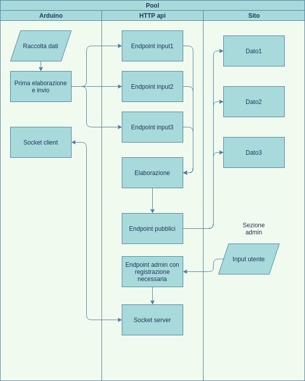

## Frontend:

 framework: https://svelte.dev/

## Server http:

https://flask.palletsprojects.com/en/1.1.x/

https://blog.miguelgrinberg.com/post/designing-a-restful-api-with-python-and-flask

## Socket:

arduino-client: https://github.com/Links2004/arduinoWebSockets

server: https://github.com/miguelgrinberg/Flask-SocketIO

frontend-client: https://socket.io/docs/v2
